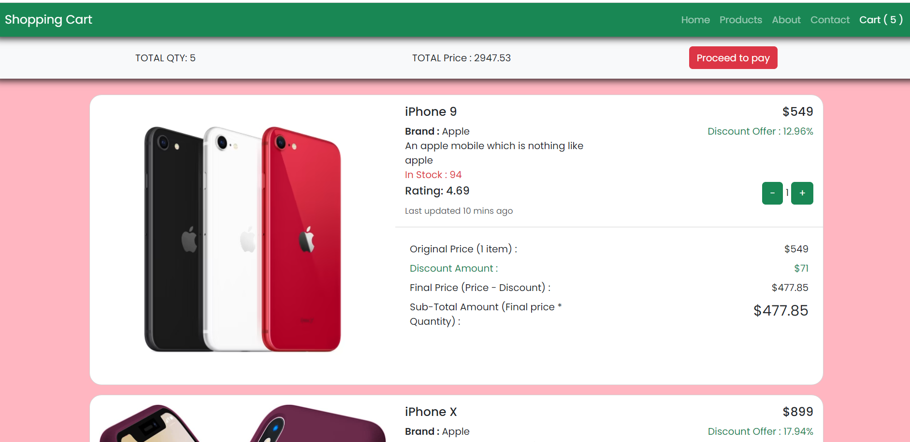

# React UseContext Task :

The provided React code establishes a shopping cart functionality using Context API. It defines a CartContext to manage cart state and actions. The Cart component displays items with options to update quantities and remove items. Integration involves using CartProvider in the main application, offering a scalable and centralized approach for managing shopping cart state.

# Screen Shot

# React + Vite

This template provides a minimal setup to get React working in Vite with HMR and some ESLint rules.

Currently, two official plugins are available:

- [@vitejs/plugin-react](https://github.com/vitejs/vite-plugin-react/blob/main/packages/plugin-react/README.md) uses [Babel](https://babeljs.io/) for Fast Refresh
- [@vitejs/plugin-react-swc](https://github.com/vitejs/vite-plugin-react-swc) uses [SWC](https://swc.rs/) for Fast Refresh
